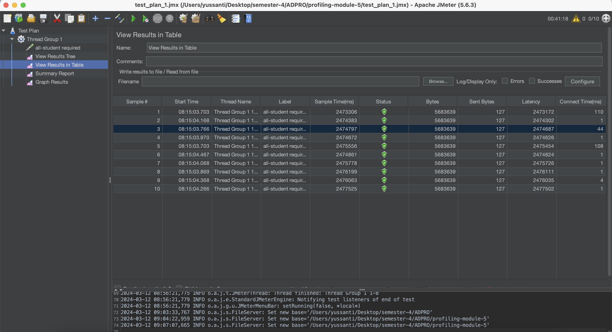
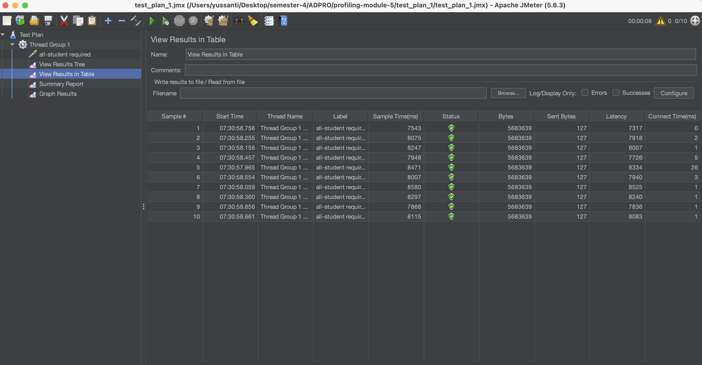
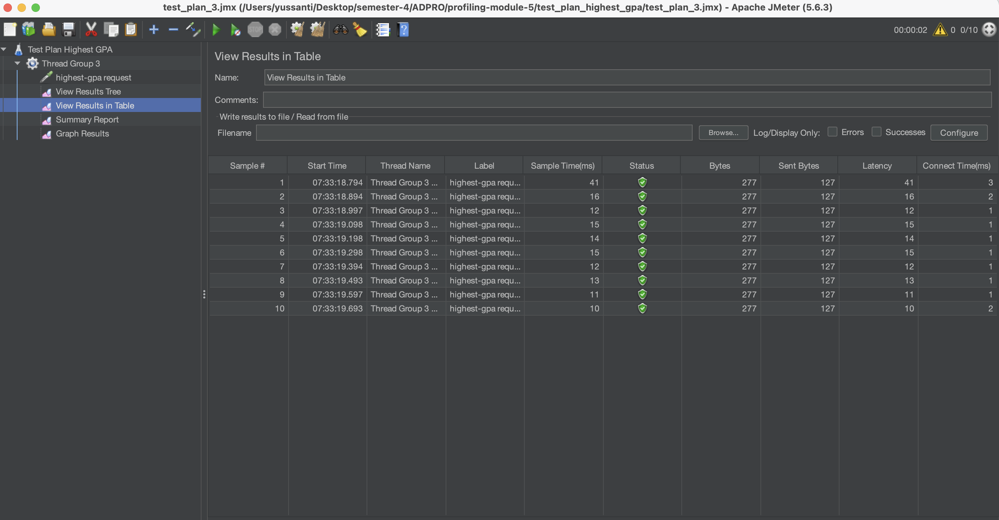
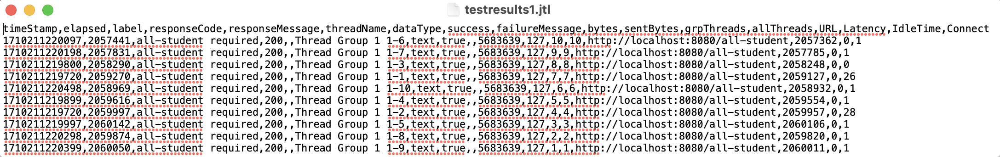
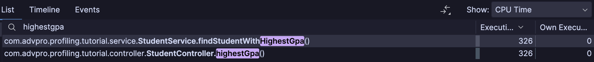

Module 5 - Java Profiling

✨Reflection✨
1. What is the difference between the approach of performance testing with JMeter and profiling with IntelliJ Profiler in the context of optimizing application performance?
> Pendekatan performance testing dengan JMeter mengukur throughput, response time, dan penggunaan resource ketika diberikan beban kerja dalam tertentu. Sementara itu, profiling dengan IntelliJ Profiler fokus pada analisis detail penggunaan resource dan waktu eksekusi dalam aplikasi, membantu mengidentifikasi bagian kode di mana perbaikan kode dapat meningkatkan kinerja aplikasi secara keseluruhan.
2. How does the profiling process help you in identifying and understanding the weak points in your application? 
> Proses profiling akan membantu mengidentifikasi dan memahami fokus bagian kode yang paling tidak bagus performanya. Akan diberikan visualsasi dan data terkait penggunaan resource seperti CPU, memory, dan waktu eksekusi di berbagai bagian kode. Dengan menganalisis data ini, kita dapat mengidentifikasi fungsi atau bagian kode yang memakan resource berlebihan. Dengan pemahaman ini, kita dapat melakukan optimasi yang tepat untuk meningkatkan performance kode.
3. Do you think IntelliJ Profiler is effective in assisting you to analyze and identify bottlenecks in your application code? 
> Ya, IntelliJ Profiler sangat efektif dalam membantu menganalisis dan mengidentifikasi bottleneck dalam kode aplikasi kita karena bantuan visualisasinya. 
4. What are the main challenges you face when conducting performance testing and profiling, and how do you overcome these challenges? 
> Saya belum pernah melakukan performance testing sebelumnya jadi saya cukup kesulitan pada awalnya terkait bagaimana membaca visualisasi data nya. Namun dibantu oleh tutorial, saya jadi lebih paham terkait visualisasi testiing tersebut.
5. What are the main benefits you gain from using IntelliJ Profiler for profiling your application code? 
> Ketika menggunakan intellij profiler, kita bisa lebih mudah dalam mengidentifikasi dan memperbaiki masalah performance kode karena visualisasinya jelas, mana bagian kode yang paling memakan resource. 
6. How do you handle situations where the results from profiling with IntelliJ Profiler are not entirely consistent with findings from performance testing using JMeter? 
> Test (profiling lalu hit endpoint pada intellij dan begitu juga pada jmeter) dilakukan berkali-kali agar bisa terlihat rata-rata dari test result. Lalu nantinya setelah perbaikan performa lalu testiing lagi, hasil testnya akan cukup konsisten.
7. What strategies do you implement in optimizing application code after analyzing results from performance testing and profiling? How do you ensure the changes you make do not affect the application's functionality?
> Saya melakukan refactoring dengan membuat isi method menjadi lebiih efisien kodenya. Seperti misalnya pada method joinStudentNames, saya menggunakan StringBuilder daripada melakukan konkatenasi string secara terus menerus agar tidak boros memory.

📷 Test Result Screenshots 📷
* JMeter Tests
    * all-student Request (Before)
      
    * all-student Request (After)
      
    * all-student-name Request (Before)
      
    * all-student-name Request (After)
      
    * highest-gpa Request (Before)
      
    * highest-gpa Request (After)
      

* JMeter Command Line Tests
    * all-student-name 
      
    * highest-gpa
      
    * all-student
      

* Profiling with IntelliJ Profiler
    * allStudentName (Before)
      
    * allStudentName (After)
      
    * getAllStudentWithCourses (Before)
      
    * getAllStudentWithCourses (After)
      
    * highestGpa (Before)
      
    * highestGpa (After)
      